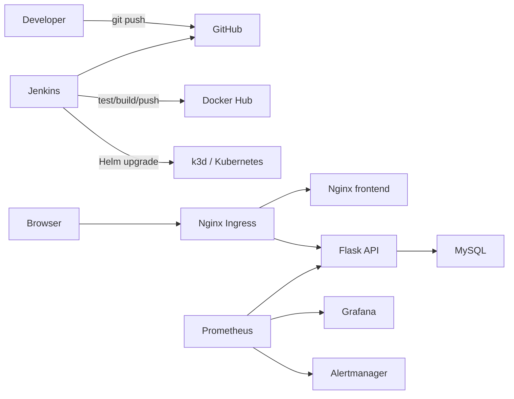

# DevOps Web Platform

基于 Kubernetes 的 Web 应用自动化部署与监控平台，是一个面向 DevOps 初级岗位的个人实践项目。项目目标不是堆叠工具，而是用一条可以运行、验证、排错和复现的完整链路串联常见 DevOps 技能。

## 当前状态

**Phase 0：环境与仓库初始化。**

目前已完成 Windows + WSL2 Ubuntu 开发环境、Docker Desktop WSL 集成、kubectl、Helm、k3d、VS Code WSL，以及可重复执行的环境检查入口。业务应用、容器编排、CI/CD 和监控功能仍处于后续计划阶段，README 不将它们描述为已实现能力。

运行环境检查：

```bash
make check
```

## 规划中的系统



## 技术栈

- Git、GitHub
- Docker、Docker Compose
- Python、Flask、pytest
- Nginx、MySQL 8.4 LTS
- Jenkins Pipeline
- k3d、Kubernetes v1.36、Helm 4
- Prometheus、Grafana、Alertmanager
- Bash、Makefile

## 实施路线

1. Phase 0：环境准备、仓库初始化、先决条件检查。
2. Phase 1：静态前端、Flask API、MySQL 初始化与单元测试。
3. Phase 2：Dockerfile、Docker Compose、本地多容器联调。
4. Phase 3：k3d 集群、Nginx Ingress、Helm Chart 与持久化。
5. Phase 4：Jenkins 测试、构建、推送、部署和验证流水线。
6. Phase 5：Prometheus 指标、Grafana 仪表盘和 Alertmanager 告警。
7. Phase 6：Pod 自愈、失败发布回滚、Runbook 与复盘。

## 目录边界

```text
app/       application source and database initialization
deploy/    Compose, Helm, Kubernetes and monitoring configuration
scripts/   repeatable environment, deployment and drill commands
docs/      architecture, deployment evidence, runbooks and postmortems
```

## 安全规则

- 不提交 `.env`、真实密码、Token、恢复码、私钥或 kubeconfig。
- `.env.example` 只包含变量名和不可用于部署的示例值。
- CI/CD 凭据后续保存在 Jenkins Credentials 中，不写入 Jenkinsfile。
- Kubernetes 密码通过运行时参数或未跟踪的本地文件传入。
- 如果凭据曾进入 Git 历史，立即吊销并重新生成，不能只删除当前文件。

## 本地环境基线

- Windows 11 + WSL2 Ubuntu 26.04
- Docker Desktop 4.87 / Docker Engine 29.7 / Compose 5.4
- kubectl 1.36.x / k3s 1.36.2
- Helm 4.2 / k3d 5.9
- Python 3.14 / Git 2.53

## 项目原则

项目只记录经过实际验证的能力。第一版不加入 Terraform、Ansible、Argo CD、Harbor、ELK、Service Mesh 或多集群，以保证每个进入仓库的组件都能够解释和排错。
