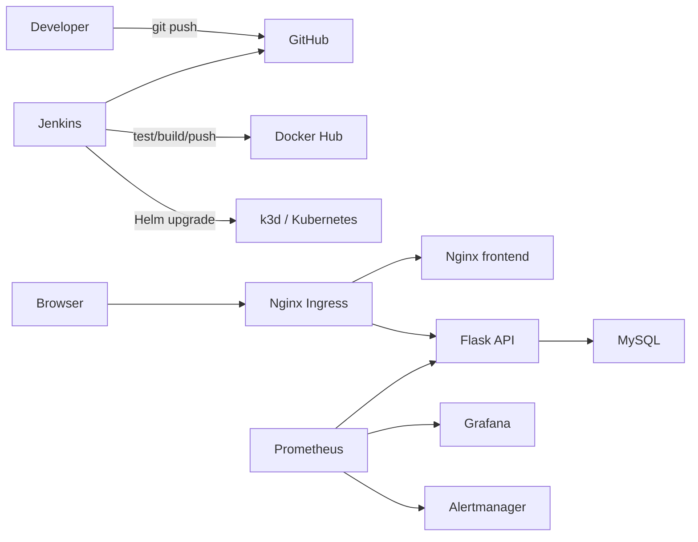

# DevOps Web Platform

基于 Kubernetes 的 Web 应用自动化部署与监控平台，是一个面向 DevOps 初级岗位的个人实践项目。项目目标不是堆叠工具，而是用一条可以运行、验证、排错和复现的完整链路串联常见 DevOps 技能。

## 当前状态

**Phase 1：最小业务应用。**

已实现一个“运维任务清单”：Flask 提供静态页面和 CRUD API，PyMySQL 使用参数化 SQL 读写 MySQL 8.4，`/healthz` 检查应用进程，`/readyz` 验证数据库连接。pytest 覆盖核心接口，验收脚本会真实停止并恢复 MySQL 以验证健康检查行为。

Docker Compose、Kubernetes、Helm、Jenkins 和监控仍属于后续阶段，当前文档不把它们描述为已完成能力。

## 快速验证

在 WSL Ubuntu 中执行：

```bash
cd ~/projects/devops-web-platform
python3 -m venv .venv
.venv/bin/python -m pip install -r app/backend/requirements.txt
cp .env.example .env
make phase1-verify
```

验收内容包括 Python 语法、pytest、真实 MySQL 连接、CRUD，以及数据库停机和恢复后的 readiness 状态。

## 本地运行

```bash
make phase1-db-up
make phase1-run
```

浏览器访问 <http://127.0.0.1:5000>。停止应用按 `Ctrl+C`，停止数据库但保留数据执行：

```bash
make phase1-db-down
```

## 健康检查

- `/healthz`：只表示 Flask 进程可以响应，不依赖 MySQL。
- `/readyz`：执行真实数据库连接检查；MySQL 不可用时返回 HTTP 503。

这种区分会在 Kubernetes 阶段分别用于 livenessProbe 和 readinessProbe。

## 规划中的系统



## 技术栈

- Git、GitHub
- Python、Flask、PyMySQL、pytest
- MySQL 8.4 LTS
- Docker、Docker Compose（Phase 2）
- Jenkins Pipeline（Phase 4）
- k3d、Kubernetes、Helm（Phase 3）
- Prometheus、Grafana、Alertmanager（Phase 5）
- Bash、Makefile

## 实施路线

1. Phase 0：环境准备、仓库初始化、先决条件检查。✅
2. Phase 1：静态前端、Flask API、MySQL 初始化与单元测试。✅
3. Phase 2：Dockerfile、Docker Compose、本地多容器联调。
4. Phase 3：k3d 集群、Nginx Ingress、Helm Chart 与持久化。
5. Phase 4：Jenkins 测试、构建、推送、部署和验证流水线。
6. Phase 5：Prometheus 指标、Grafana 仪表盘和 Alertmanager 告警。
7. Phase 6：Pod 自愈、失败发布回滚、Runbook 与复盘。

## 安全规则

- 不提交 `.env`、真实密码、Token、恢复码、私钥或 kubeconfig。
- `.env.example` 只包含本地无敏感示例值。
- SQL 使用参数绑定，不拼接用户输入。
- CI/CD 凭据后续保存在 Jenkins Credentials 中。
- 如果凭据曾进入 Git 历史，立即吊销并重新生成。

## 项目原则

项目只记录经过实际验证的能力。第一版不加入 Terraform、Ansible、Argo CD、Harbor、ELK、Service Mesh 或多集群，以保证每个进入仓库的组件都能够解释和排错。
